# Infrastructure for Shovel Heros

A comprehensive Terraform configuration for deploying cloud-native applications on AWS with multi-region support, focusing on Taiwan region (ap-east-2).

## Architecture Overview

This infrastructure supports scalable applications with enterprise-grade features:

- **EKS clusters** for container orchestration with Amazon Linux 2023 node groups
- **Multi-region support** with configurable regional deployments
- **CI/CD pipelines** using GitHub Actions with OIDC authentication
- **Data processing infrastructure** including RDS databases and S3
- **Security features** with Secrets Manager, IAM roles, and security groups
- **Monitoring and alerting** through CloudWatch

### Architecture Diagram

```mermaid
graph TB
    subgraph Internet
        Users[Users/Clients]
        CDN[CloudFront CDN<br/>Production Only]
    end

    subgraph "AWS Region: ap-east-2 (Taipei)"
        subgraph "VPC 10.0.0.0/16"
            subgraph "Public Subnets"
                IGW[Internet Gateway]
                NAT1[NAT Gateway AZ1]
                NAT2[NAT Gateway AZ2]
                ALB[Application Load Balancer<br/>HTTP/HTTPS]
            end

            subgraph "Private Subnets - AZ1"
                subgraph "EKS Cluster"
                    EKS1[EKS Node<br/>t3.small/medium SPOT<br/>AL2023]
                    VPC_CNI1[VPC CNI]
                    CoreDNS1[CoreDNS]
                    KubeProxy1[Kube-proxy]
                end
            end

            subgraph "Private Subnets - AZ2"
                subgraph "EKS Cluster "
                    EKS2[EKS Node<br/>t3.small/medium SPOT<br/>AL2023]
                    VPC_CNI2[VPC CNI]
                    CoreDNS2[CoreDNS]
                    KubeProxy2[Kube-proxy]
                end
                RDS[(RDS PostgreSQL 16.9<br/>Multi-AZ Production<br/>gp3 Storage)]
            end
        end

        subgraph "S3 Storage"
            S3_Backup[Backup Bucket<br/>DB Backups]
        end

        subgraph "Container Registry"
            ECR_Backend[ECR: Backend Images]
            ECR_Frontend[ECR: Frontend Images]
        end

        subgraph "Security & Secrets"
            Secrets[Secrets Manager<br/>- DB Credentials<br/>- JWT Secrets<br/>- App Config]
            KMS_Secrets[KMS Key: Secrets]
            KMS_RDS[KMS Key: RDS]
            KMS_S3[KMS Key: S3]
        end

        subgraph "Security"
            WAF[AWS WAF<br/>Rate Limiting<br/>Geo-blocking]
            SG_ALB[SG: ALB<br/>80, 443]
            SG_Backend[SG: Backend Pods<br/>8787]
            SG_RDS[SG: RDS<br/>5432]
        end

        subgraph "Monitoring"
            CW_Metrics[CloudWatch Metrics]
            CW_Alarms[CloudWatch Alarms<br/>- High CPU<br/>- RDS CPU<br/>- ALB Health]
            CW_Dashboard[CloudWatch Dashboard]
        end

        subgraph "IAM"
            IRSA[IAM Roles for Service Accounts<br/>OIDC Provider]
            Pod_Role[Backend Pod Role<br/>- Secrets Access<br/>- S3 Backup Access<br/>- CloudWatch Logs]
            ALB_Role[ALB Controller Role<br/>- ELB Permissions<br/>- EC2 Permissions<br/>- Target Group Mgmt]
        end

        subgraph "Load Balancer Controller"
            ALB_Controller[AWS Load Balancer Controller<br/>Helm Chart<br/>v2.13.4]
            TGB_Backend[TargetGroupBinding<br/>Backend → TG]
            TGB_Frontend[TargetGroupBinding<br/>Frontend → TG]
        end
    end

    subgraph "Route53"
        R53[Route53 Hosted Zone<br/>shovel-heroes.cc]
        R53_ROOT[shovel-heroes.cc → ALB]
        R53_API[api.shovel-heroes.cc → ALB]
    end

    subgraph "ACM Certificates (ap-east-2)"
        ACM_ALB[ACM Certificate<br/>ALB<br/>shovel-heroes.cc<br/>*.shovel-heroes.cc]
    end

    %% User Flow
    Users -->|HTTP/HTTPS| R53
    R53_ROOT -->|Frontend| ALB
    R53_API -->|API| ALB

    %% Load Balancer Flow
    IGW --> ALB
    WAF -.->|Protect| ALB
    ALB -->|api.shovel-heroes.cc → Backend TG<br/>Port 8787| TGB_Backend
    ALB -->|shovel-heroes.cc/api/* → Backend TG<br/>Port 8787| TGB_Backend
    ALB -->|shovel-heroes.cc/* → Frontend TG<br/>Port 8080| TGB_Frontend
    TGB_Backend -->|Register Pods| EKS1
    TGB_Backend -->|Register Pods| EKS2
    TGB_Frontend -->|Register Pods| EKS1
    TGB_Frontend -->|Register Pods| EKS2
    ALB_Controller -.->|Manage| TGB_Backend
    ALB_Controller -.->|Manage| TGB_Frontend
    ALB_Role -.->|Permissions| ALB_Controller

    %% EKS to RDS
    EKS1 -.->|PostgreSQL<br/>5432| RDS
    EKS2 -.->|PostgreSQL<br/>5432| RDS

    %% EKS to Secrets
    EKS1 -.->|IAM/IRSA| Pod_Role
    EKS2 -.->|IAM/IRSA| Pod_Role
    Pod_Role -.->|Read| Secrets

    %% EKS to S3
    EKS1 -.->|Backups| S3_Backup
    EKS2 -.->|Backups| S3_Backup

    %% NAT Gateway
    EKS1 --> NAT1
    EKS2 --> NAT2
    NAT1 --> IGW
    NAT2 --> IGW

    %% ECR
    EKS1 -.->|Pull Images| ECR_Backend
    EKS2 -.->|Pull Images| ECR_Backend

    %% Encryption
    Secrets -.->|Encrypted by| KMS_Secrets
    RDS -.->|Encrypted by| KMS_RDS
    S3_Frontend -.->|Encrypted by| KMS_S3
    S3_Backup -.->|Encrypted by| KMS_S3

    %% Security Groups
    SG_ALB -.->|Allow| ALB
    SG_Backend -.->|Allow| EKS1
    SG_Backend -.->|Allow| EKS2
    SG_RDS -.->|Allow| RDS

    %% Monitoring
    EKS1 -.->|Metrics| CW_Metrics
    EKS2 -.->|Metrics| CW_Metrics
    RDS -.->|Metrics| CW_Metrics
    ALB -.->|Metrics| CW_Metrics
    CW_Metrics --> CW_Alarms
    CW_Metrics --> CW_Dashboard

    %% Certificates
    ACM_CF -.->|Used by| CDN
    ACM_ALB -.->|Used by| ALB

    style Users fill:#e1f5ff
    style CDN fill:#ff9900
    style ALB fill:#ff9900
    style EKS1 fill:#ff9900
    style EKS2 fill:#ff9900
    style RDS fill:#3b48cc
    style S3_Frontend fill:#569a31
    style S3_Backup fill:#569a31
    style Secrets fill:#dd344c
    style WAF fill:#dd344c
    style KMS_Secrets fill:#dd344c
    style KMS_RDS fill:#dd344c
    style KMS_S3 fill:#dd344c
```



### Key Features

- **High Availability**: Multi-AZ deployment across 2 availability zones (3 in production)
- **Cost Optimized**: SPOT instances for non-production, right-sized resources
- **Secure**: KMS encryption at rest, Secrets Manager, WAF protection, private subnets
- **Scalable**: Auto-scaling EKS node groups (1-3 nodes)
- **Production CDN**: CloudFront distribution with OAC for production environments
- **Monitoring**: CloudWatch metrics, alarms, and dashboards

## Project Structure

```
.
├── CLAUDE.md                    # Project instructions and quick commands
├── README.md                    # This file
├── .gitignore                   # Git ignore patterns
├── terraform.tfvars.example     # Example configuration file
├── scripts/
│   └── validate.sh              # Terraform validation and planning script
├── versions.tf                  # Terraform and provider version constraints
├── provider.tf                  # Provider configurations (AWS, Cloudflare, GitHub)
├── backend.tf                   # S3 backend configuration
├── variable.tf                  # Input variable declarations
├── local.tf                     # Local value definitions and feature flags
├── data.tf                      # Data source definitions
├── vpc.tf                       # VPC, subnets, routing
├── vpc_security_groups.tf       # Security groups for different tiers
├── eks.tf                       # EKS cluster with AL2023 node groups
├── iam_eks.tf                   # IAM roles for EKS
├── iam_app.tf                   # IAM roles for application (GitHub Actions, pods)
├── rds.tf                       # PostgreSQL database configuration
├── s3.tf                        # S3 buckets with lifecycle policies
├── cloudwatch.tf               # Monitoring, logging, and dashboards
├── outputs.tf                   # Resource outputs
├── plans/                       # Generated Terraform plans (gitignored)
├── logs/                        # Validation and execution logs (gitignored)
└── .kiro/steering/             # Project steering documentation
    ├── product.md              # Product overview and features
    ├── structure.md            # Project structure and conventions
    └── tech.md                 # Technology stack and commands
```

## Quick Start

### Prerequisites

- Terraform >= 1.9.8
- AWS CLI configured with appropriate credentials
- Access to Taiwan region (ap-east-2)

### Deployment

1. **Initialize Terraform:**
   ```bash
   terraform init
   ```

2. **Review and customize variables:**
   ```bash
   # Edit variables in variable.tf or create terraform.tfvars
   cp terraform.tfvars.example terraform.tfvars
   # Edit terraform.tfvars with your specific values
   ```

3. **Validate and plan the deployment:**
   ```bash
   # Use the comprehensive validation script
   ./scripts/validate.sh
   
   # Or use standard terraform commands
   terraform plan
   ```

4. **Apply the configuration:**
   ```bash
   # Apply from saved plan (recommended)
   terraform apply "plans/tfplan_YYYYMMDD_HHMMSS.out"
   
   # Or apply directly
   terraform apply
   ```

### Essential Commands

```bash
# Comprehensive validation with plan generation
./scripts/validate.sh

# Format and validate
terraform fmt
terraform validate

# Standard workflow
terraform init
terraform plan
terraform apply

# Apply from saved plan
terraform apply "plans/tfplan_YYYYMMDD_HHMMSS.out"

# Destroy resources (use with caution)
terraform destroy
```

## Validation Script

The `scripts/validate.sh` script provides comprehensive Terraform validation with the following features:

### What it does:
1. **Format check** - Validates and fixes Terraform formatting
2. **Configuration validation** - Ensures syntax and logic are correct
3. **Plan generation** - Creates timestamped plan files in `plans/`
4. **Detailed logging** - Saves all output to timestamped log files in `logs/`
5. **Security scanning** - Runs `tfsec` if available
6. **Cost estimation** - Generates cost estimates with `infracost` if available
7. **Cleanup** - Automatically removes old plan and log files (keeps last 10)

### Usage:
```bash
# Run comprehensive validation
./scripts/validate.sh

# Apply from generated plan
terraform apply "plans/tfplan_20231215_143022.out"
```

### Optional tools:
- **tfsec**: Install with `brew install tfsec` for security scanning
- **infracost**: Install from [infracost.io](https://www.infracost.io/docs/#quick-start) for cost estimation

## Configuration

### Environment Variables

Create a `terraform.tfvars` file with your specific values:

```hcl
project_name = "my-app"
primary_region = "ap-east-2"

env_vars = {
  env_name = "production"
  env_type = "prod"
}

secrets = {
  database_password = "your-secure-password"
}

cloudflare_api_token = "your-cloudflare-token"
```

### Feature Flags

Control which components to deploy using local values in `local.tf`:

```hcl
locals {
  eks_enabled    = true   # Deploy EKS cluster
  rds_enabled    = true   # Deploy RDS database
  s3_enabled     = true   # Deploy S3 buckets
  taipei_enabled = true   # Deploy Taiwan region resources
}
```

## Infrastructure Components

### Networking
- **VPC:** 10.0.0.0/16 with public and private subnets across 3 AZs
- **NAT Gateways:** One per AZ for high availability
- **Security Groups:** Tiered access (external, internal, RDS)

### Compute
- **EKS Cluster:** Kubernetes 1.33 with managed node groups on Amazon Linux 2023:
  - **General:** SPOT instances for cost optimization
  - **Workflow:** ON_DEMAND with taints for isolation
  - **Compute:** Scalable compute-intensive workloads

### CI/CD
- **GitHub Actions OIDC:** Secure authentication without AWS credentials
- **IAM Roles:** Granular permissions for ECR, EKS, S3, and CloudFront
- **Automated Deployments:** Push to ECR and deploy to EKS via kubectl

### Data Storage
- **RDS:** PostgreSQL 16.8 with encryption and automated backups
- **S3:** Versioned buckets with lifecycle policies and encryption

### Monitoring
- **CloudWatch:** Centralized logging and metrics
- **Dashboards:** Real-time infrastructure monitoring
- **Alarms:** CPU and resource utilization alerts

## Building from Scratch with CLAUDE.md

This project was built following the steering documentation pattern using Claude Code. Here's how to recreate or extend this infrastructure:

### 1. Project Foundation

The project starts with `CLAUDE.md` which contains:
- Quick reference commands
- Links to detailed steering documentation in `.kiro/steering/`
- Important instruction reminders

### 2. Steering Documentation

Three key files guide the project structure:

**`.kiro/steering/product.md`** - Defines what we're building:
- Product overview and features
- Target platform (AWS with multi-region)
- Core services (EKS, RDS, S3, etc.)

**`.kiro/steering/structure.md`** - Defines how we organize:
- File naming conventions
- Resource organization patterns
- Architecture patterns (conditional resources, multi-region)

**`.kiro/steering/tech.md`** - Defines technical stack:
- Terraform version constraints
- Provider versions
- Common commands and workflow

### 3. Code Generation Process

With Claude Code, you can generate infrastructure by:

1. **Reading the steering files** to understand requirements
2. **Following naming conventions** from structure.md
3. **Using technology constraints** from tech.md
4. **Implementing features** described in product.md

Example prompt for extending this project:
```
Please add Lambda functions for data processing based on the project steering files
```

Claude will:
- Read the steering documentation
- Follow established patterns
- Create `lambda.tf` with appropriate naming
- Add IAM roles in `iam_lambda.tf`
- Update locals and variables as needed

### 4. Extending the Infrastructure

To add new components:

1. **Update steering docs** if adding new product features
2. **Add feature flags** in `local.tf`
3. **Create resource files** following naming patterns
4. **Add IAM roles** in separate `iam_*.tf` files
5. **Update outputs** for new resources

### 5. Best Practices

- **Version control steering docs** alongside infrastructure code
- **Use feature flags** for optional components
- **Follow naming conventions** consistently
- **Separate concerns** (networking, compute, data, IAM)
- **Document decisions** in steering files

## Security Considerations

- All S3 buckets block public access by default
- RDS instances use encryption at rest
- Security groups follow least privilege principle
- IAM roles have minimal required permissions
- Resources are tagged for compliance and cost tracking

## Cost Optimization

- SPOT instances for non-critical workloads
- S3 lifecycle policies for data archival
- Conditional resource deployment
- Right-sized instances based on environment

## Contributing

1. Review steering documentation in `.kiro/steering/`
2. Follow established naming conventions
3. Test changes with `terraform plan`
4. Update documentation when adding features

## Support

For issues or questions:
- Check steering documentation first
- Review Terraform plan output
- Validate AWS permissions and quotas
- Ensure region availability (ap-east-2)
